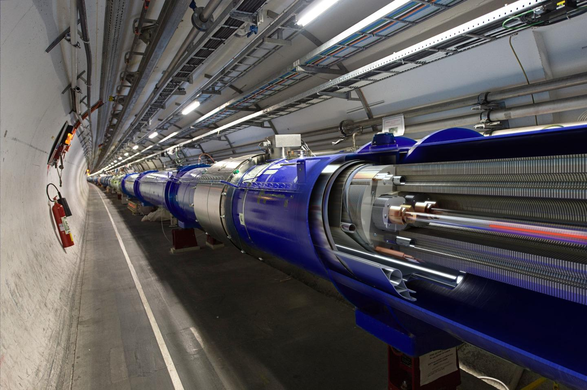
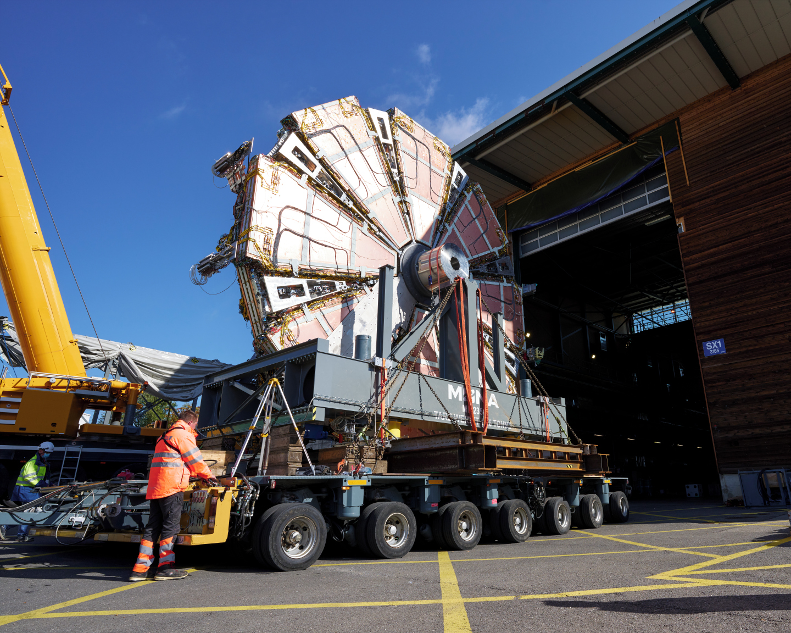
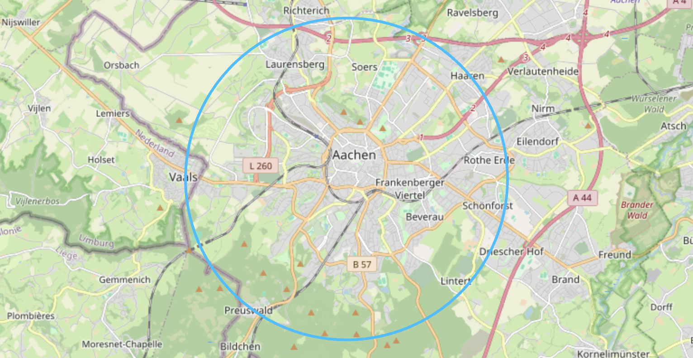
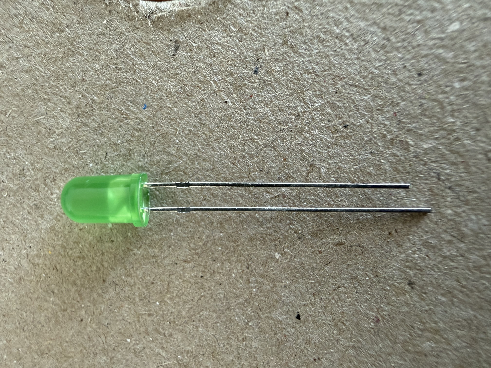
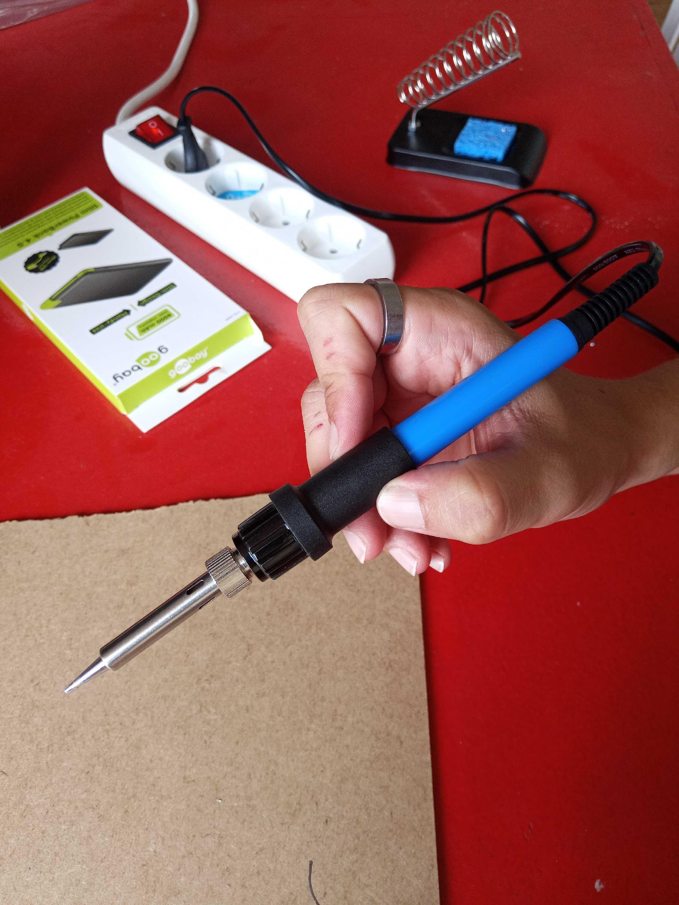
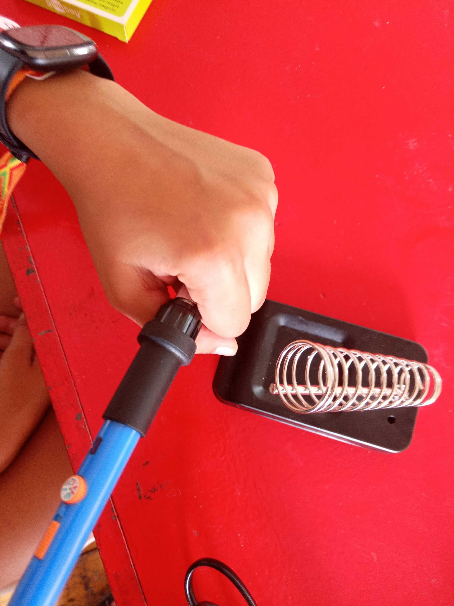
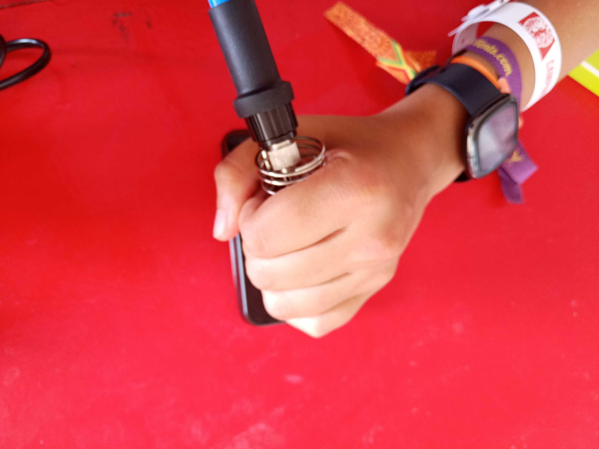

<!-- _class: title invert -->

# The Higgs Circuit

## Complete your own Higgs Circuit

---

# CERN - European Organization for Nuclear Research

* Largest particle physics laboratory in the world

* Its main mission is fundamental research in particle physics

* CERN builds the largest machines to study the smallest particles

---

# ACCELERATORS

---

# DETECTORS

---

# ATLAS

---

# 2012: Higgs Boson

---

# The Small Wheel

---

# The Large Hadron Collider (LHC)

---

# The Circuit

- The board
- A battery pack + batteries
- A handful of LEDs

---

# LED - Light Emitting Diode

Long leg - towards plus
Short leg - towards minus

---

# TWO SIMPLE RULES

1) The soldering irons are hot
2) The soldering irons are very hot

---

# Hold it like this

---

# Not like this

---

# Not like this

---

# If you smell roast chicken...

## ... you are holding it wrong

---

# LED - Light Emitting Diode

Long leg - towards plus
Short leg - towards minus

